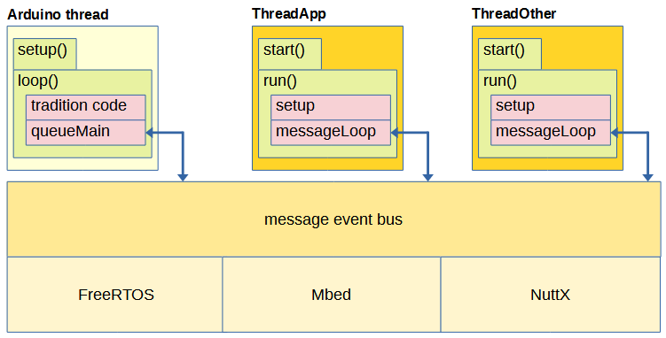
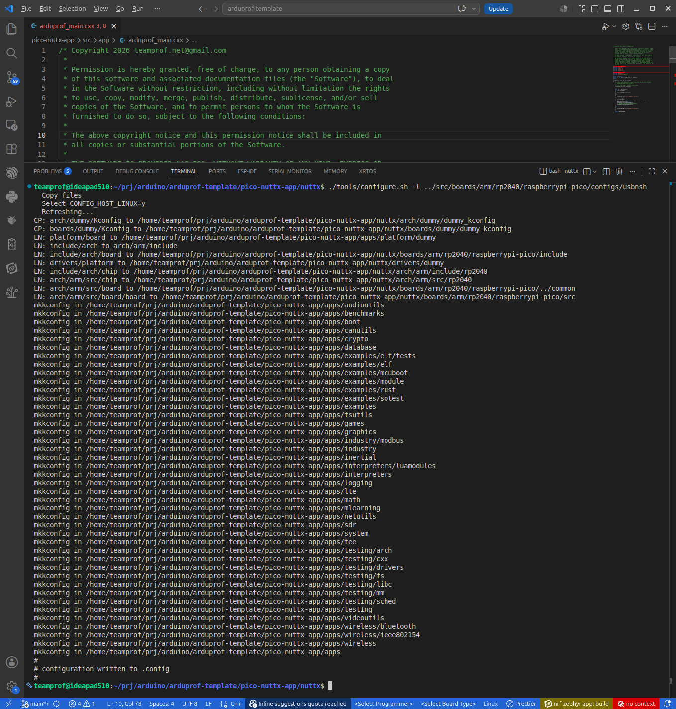
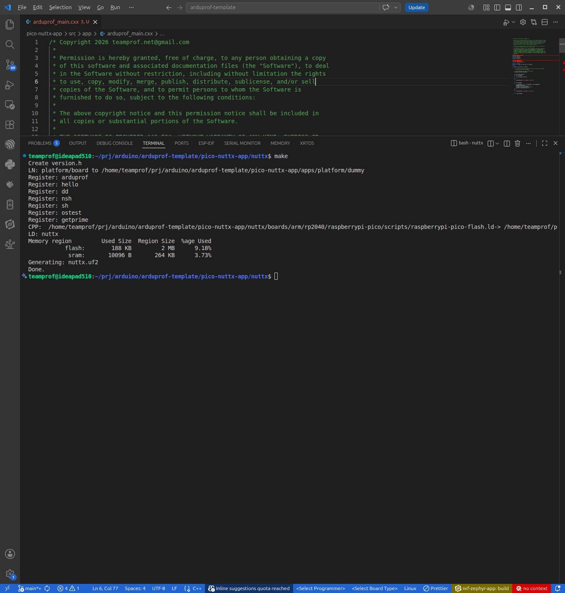
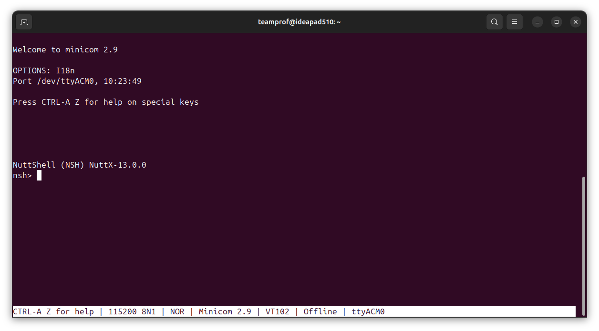
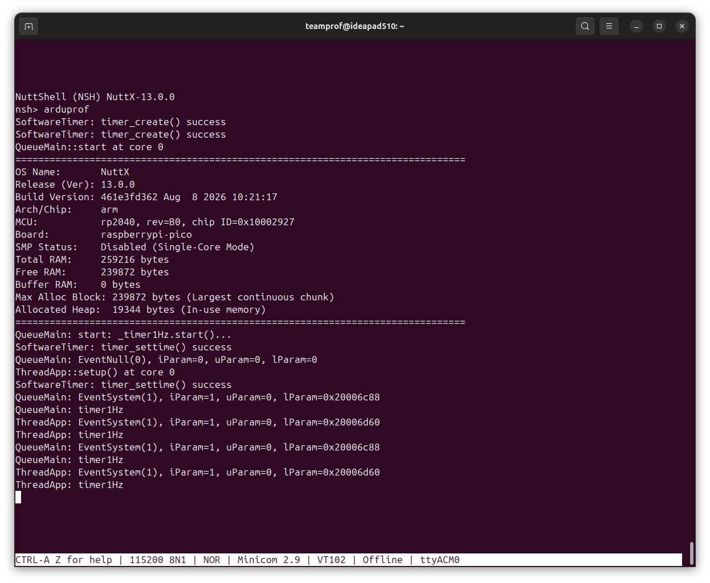

## Reference code of running NuttX on Pi Pico/Pico2 with ArduProf framework

Running Apache NuttX on a Raspberry Pi Pico/Pico2 transforms the modest microcontroller board into a POSIX-compliant, multi-threaded system. It unlocks the full dual-core potential via symmetric multiprocessing (SMP), provides a familiar Unix-like shell environment (NSH) over USB, and introduces robust driver abstractions for hardware like I2C, SPI, and ADC.

This repository leverages the ArduProf library to demonstrate a highly efficient, message-driven, multi-threaded application structure. By integrating this library, the system can cleanly segregate tasks into independent threads that communicate via asynchronous messages. This design minimizes thread blocking, optimizes CPU utilization across the Pico’s dual cores, and simplifies complex real-time firmware architectures into manageable, event-driven components.

[](https://github.com/teamprof/ArduProf/blob/main/doc/image/framework-diagram.png)

---

[](https://github.com/teamprof/ArduProf/blob/main/LICENSE)

<a href="https://www.buymeacoffee.com/teamprof" target="_blank"></a>

---

## Supported Hardware (Pi Pico/Pico2)

The following boards are supported by this project:
- [Raspberry Pi Pico](https://www.raspberrypi.com/documentation/microcontrollers/raspberry-pi-pico.html)
- [Raspberry Pi Pico2](https://www.raspberrypi.com/products/raspberry-pi-pico-2/)

---


## Reference code setup for Raspherry Pi Pico/Pico2
- Launch a terminal app
- clone this repo by "git clone --recurse-submodules https://github.com/teamprof/arduprof-template.gif"
- Change to folder "arduprof-template/pico-nuttx-app" and create a symbolic link
  ```
  cd arduprof-template/pico-nuttx-app
  ln -s ../src apps/arduprof
  ```
---

## Build reference code for Pi Pico
- Change to "arduprof-template/pico-nuttx-app/nuttx" folder in terminal.
  ```
  cd nuttx
  ```
- Type the following command and press ENTER.
  ```
  ./tools/configure.sh -l ../src/boards/arm/rp2040/raspberrypi-pico/configs/usbnsh
  ```
- If everything goes smoothly, you should see the following screen:  
  [](https://github.com/teamprof/arduprof-template/blob/main/assets/config-usbnsh.png)

- Build firmware by typing command and press ENTER.
  ```
  make
  ```

- If everything goes smoothly, you should see the following screen:  
  [](https://github.com/teamprof/arduprof-template/blob/main/assets/build-usbnsh.png)


## Flash reference code on Pi Pico
- Press and hold the BOOTSEL button on the Pi Pico.
- Plug the USB cable into the Pico and your PC.
- Release the BOOTSEL button after it is plugged in.
- Launch a terminal and change to the "pico-nuttx-app/nuttx" folder.
- Type the following command and press ENTER.
  ```
  cp nuttx.uf2 /media/teamprof/RPI-RP2 
  ```

## Run reference code on Pi Pico
- Unplug the USB cable from the Pico or your computer.
- Wait 2 to 3 seconds for the power to completely drain.
- Plug the USB cable back in.
- The Pico will power up and immediately start running the firmware.

- Launch a Serial Terminal app (e.g. minicom) and connect to /dev/ttyACM0 with 8N1, 115200 bps, by the following commands
  ```
  minicom -b 115200 -D /dev/ttyACM0
  ```

- Wait 5 to 10 seconds and then press ENTER in the Serial Terminal app
- If everything goes smoothly, you should see the following screen:  
  [](https://github.com/teamprof/arduprof-template/blob/main/assets/sh-pico-usbnsh.png)

- Type the following command in the Serial Termianl app
  ```
  arduprof
  ```
- If everything goes smoothly, the on-board will toggle every second and you should see the following screen:  
[](https://github.com/teamprof/arduprof-template/blob/main/assets/run-pico-usbnsh.png)


- Good luck and enjoy NuttX on Pico/Pico2

---

### License
- The project is licensed under GNU GENERAL PUBLIC LICENSE Version 3

---

### Copyright
- Copyright 2026 teamprof.net@gmail.com. All rights reserved.
